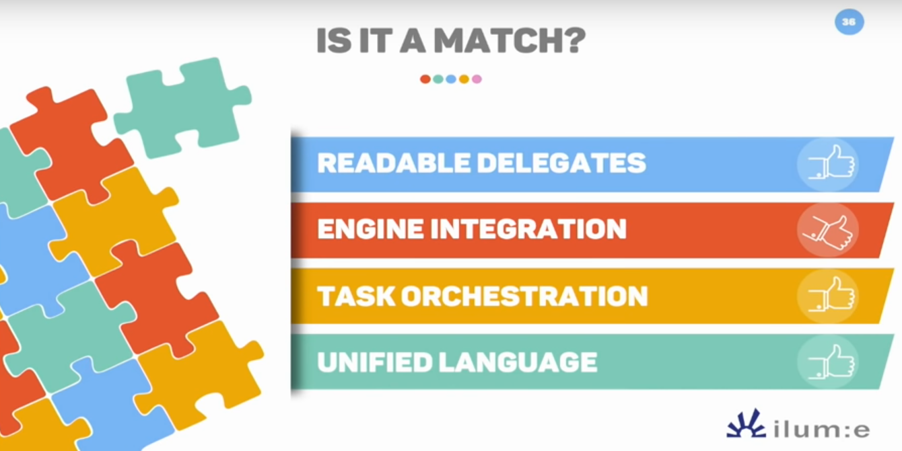
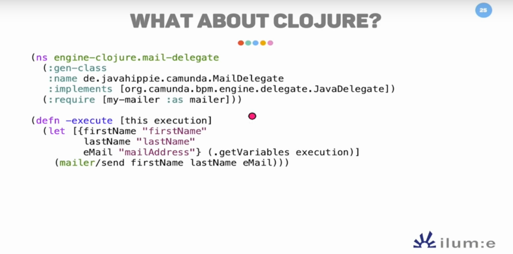
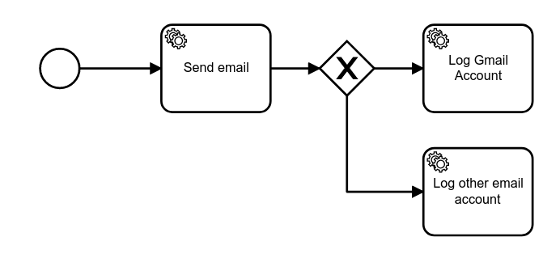
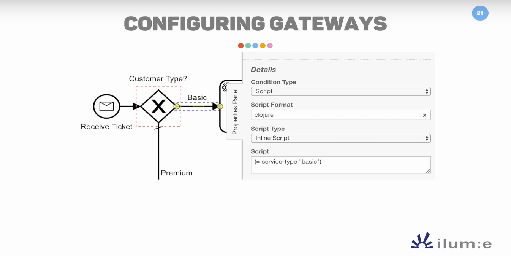

# Description

This project contains a modified version of `camunda-engine` that is more Clojure friendly.
- `lib/camunda-engine-7.15.0-SNAPSHOT.jar` based on the following commit: https://github.com/arnaudgeiser/camunda-bpm-platform/commit/3e0c618b9fc1cbcb59e971753e97297f07b5b2d9
- `resources/simple-diagram.bpmn` contains a new XML attribute called `clojure`
- `src/clj-camunda/core.clj` contains the integration and examples in `comment`

This is my answer to Tim Zöller about his talk __Workflow engines with Clojure, it's a match__.  
During his presentation, he draw a clear picture about the experience we currently have when
working with Camunda from Clojure. It's accurate, straightforward and the exploration he did
is beneficial for the community.
Here I propose to look at the situation from another angle: 

__What is the experience we want to have when working with Camunda from Clojure?__

Let's start with Tim's conclusion:



I agree on most of them, with different thumb directions. 

# Readable Delegates

I confess, delegate is more readable in Clojure than Java, but
not by a large margin. Having to generate a class for every `service task`
is impractical. But he knows it pretty well:

> We need to implement the same Java interface. This is not ideal, I know that.
> And this also lead to us... needing to precompile this class to work with the REPL



Having to work with Java Interop is not that uncomfortable. What bother me the most
is the number of lines I have to write for every square in my BPMN diagram (and the fact
that every class needs to be precompiled).

### Going further

Taking an even simpler diagram with 3 service tasks and one gateway, I would expect
to write the following either through __Java Interop__ or through a __Clojure macro__:




__Through Java Interop__

``` clojure
(defn send-mail [e]
  (let [email (get (.getVariables e) "email")]
    (prn "I'm sending an email to : " email)
    (re-find #"gmail" email)))

(defn log-other-email-account [_]
  (prn "Log other email account"))

(defn log-gmail-account [_]
  (prn "Log gmail account"))
```

__Through Clojure macro__

By having a `defprocess` macro we would be able to provide an idiomatic feeling when 
working with Camunda

``` clojure
(defmacro defprocess
  "Defines a Camunda process"
  [& clauses]
  (cons 'do
    (for [clause clauses
          :let [[n p f] clause]]
      `(defn ~n ~'[e]
          ~(if (seq p)
            `(let [~@p (execution-entity->map ~'e)] ~f)
            f)))))

(defprocess
  (send-mail [{{:keys [email]} :variables}]
    (prn (str "I'm sending an email to " email))
    (re-find #"gmail" email))
  (log-other-email-account [] (prn "Log other email account"))
  (log-gmail-account [] (prn "Log gmail account")))
```

### What needs to be done

This experience won't be available out of the box without a small contribution
in Camunda. It would be great if Camunda was able to call Clojure code.
It can be done with some minor modifications:

https://github.com/arnaudgeiser/camunda-bpm-platform/commit/3e0c618b9fc1cbcb59e971753e97297f07b5b2d9


# Engine Integration

Java Interop is not really fun, but by providing a Clojure wrapper around Camunda, it 
shouldn't be a big deal.

# Task Orchestration

As mentioned, Task Orchestration is pretty neat already. Having a keyword based API
would be more convenient

# Unified Language



In theory, Camunda should be able to support a large variety of languages. Every
JSR-233 ScriptEngine should be usable. In practice, it's not the case.
Clojure should be considered a dynamic language, but based on the following code, it was
not true:

```java
public static boolean isDynamicScriptExpression(String language, String value) {
    return StringUtil.isExpression(value) &&
                !JuelScriptEngineFactory.names.contains(language.toLowerCase());
}
```

Only languages using `${}` are considered dynamic:

```java
public static boolean isExpression(String text) {
    text = text.trim();
    return text.startsWith("${") || text.startsWith("#{");
}
```

### What needs to be done
A better support for dynamic scripting engine is necessary.
A dirty hack:

https://github.com/arnaudgeiser/camunda-bpm-platform/commit/3e0c618b9fc1cbcb59e971753e97297f07b5b2d9

# Follow-ups
- Support `clojure` or `clojure-var` attribute in Camunda Engine (https://github.com/arnaudgeiser/camunda-bpm-platform/commit/3e0c618b9fc1cbcb59e971753e97297f07b5b2d9
)
- Support `clojure` or `clojure-var` attribute in Camunda Modeler
- Better ScriptEngine support in Camunda
- Clojure wrapper around Camunda for better experience
- Some processes are simple and could be express directly from EDN files
